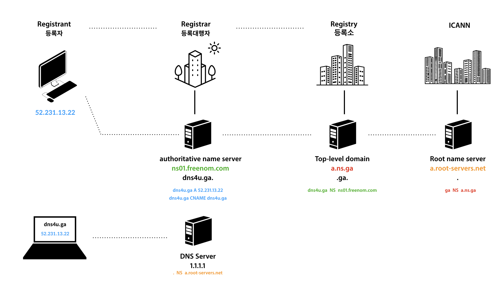

## DNS 구조

 

### 호스트?
#### : 네트워크 상에 연결되어 있는 각각의 '컴퓨터'들을 의미한다.
#### : 각 호스트 컴퓨터들은 인터넷에 연결되는 순간, 자신만의 고유한 ip 주소를 갖게 된다.(DHCP)
#### : 브라우저에 주소 입력시, 다음의 순서로 작업이 이루어진다.
1. 브라우저에 '도메인 주소' 입력하면,
2. 브라우저는 네임서버에 '도메인 주소' 요청하고,
3. 네임서버가 'IP주소'응답해주면,
4. 브라우저는 'IP주소'에 해당하는 호스트 컴퓨터(서버)에 요청하고,
5. 호스트 컴퓨터가 웹페이지 등을 응답하면,
6. 브라우저는 응답받은 결과를 화면에 렌더링 한다.

 

### 브라우저의 IP 탐색 순서
#### 브라우저 주소창에 도메인 주소를 입력하면, 다음의 순서로 IP를 찾는다.
1. local chache를 검색
    - 한번 방문한 이력이 있는 도메인의 IP주소를 기억해두고, 다음 요청시 해당 IP로 바로 이동
    - 로컬 캐시 삭제 방법 (안 되면 재부팅)
        - 윈도우 : ipconfig /renew
2. hosts 파일 검색
    - local cache에서 검색되지 않는 도메인 주소는, hosts 파일에 설정된 {도메인주소:IP}대로 이동한다.
    - 운영체제마다 특정 공간에 host 파일을 저장해두고 관리한다.
    - hosts 파일에는 {도메인주소:IP}가 저장되어 있다.
3. DNS 서버를 검색
 
 

### 네임서버(DNS: Domain Name System Server)?
#### : '도메인' 주소를 request 하면, 'IP'를 response 해주는 ***서버***
#### : 한마디로 {도메인주소:ip주소}가 저장되어 있는 전화번호부 같은 개념이다.
- 보통 도메인 판매대행(가비아 등) 업체나 DNSZi등에서 네임 서버를 제공한다.(여기에 내 {도메인:IP}가 저장된다)
- 네임서버에 문제가 생길 경우를 대비해, 보통 4~5차 네임서버까지 제공한다.
- 네임서버에 내 도메인을 설정한 다음, '도메인을 관리하는 인터닝 기관'에 내 도메인이 설정된 네임서버가 무엇인지 등록해야 한다.
    1. dnszi 등의 네임서버에 나의 도메인을 등록. 
    2. '인터닝 기관'에 내 도메인이 등록된 네임서버를 등록(도메인 구입 사이트에서 등록 가능)
#### : 도메인 네임 서버는 여러대가 있다
 

### 호스트 설정
#### : 특정 '도메인' 주소를 입력하면, 특정 ***'IP'*** 주소로 이동시키는 개념
#### : 즉, DNS 네임서버에 {도메인주소 : IP}를 설정하는 작업

 

### 포워딩 설정
#### : 특정 '도메인' 주소를 입력하면, 다른 ***'도메인'*** 주소로 이동시키는 개념
#### : blog.dogumaster.com 입력시, curryyou.tistory.com 으로 이동하도록 설정하는 작업
 1. 유동 포워딩: 주소창에 입력한 주소가 ***포워딩하는 주소로 변경*** 되면서 포워딩 됨
 2. 고정 포워딩: 주소창에 입력한 주소가 ***변경되지 않고***, 포워딩 됨

 

### Public DNS
#### 브라우저에서 특정 도메인 입력 시, DNS에 접속하여 ip를 받아오는데, DNS서버 자체의 주소는 어떻게 알 수 있을까?
#### 인터넷에 연결된 컴퓨터는 내부에 'DNS 서버의 ip주소'를 저장해둔다.
> 맥의 경우 `시스템환경설정 > 네트워크 > 고급 > DNS` 에서 확인할 수 있다.
1. 컴퓨터가 인터넷에 연결돠면,
2. 통신사(ISP)에서 자신들의 제공하는 DNS의 ip를 내 컴퓨터에 설정해둔다.
3. 이때 통신사가 제공하는거 말고, 다른 public DNS를 설정해둘 수 있다.
    - 예를 들어 cloudfare(1.1.1.1)이나 googlePulbicDNS(8.8.8.8) 등을 설정할 수 있다.
    - 맥의 경우 `시스템환경설정 > 네트워크 > 고급 > DNS` 에서 설정하면 된다.

 

### 네임서버 관리 서비스(dnszi, dnsever 등)
#### : 네임서버를 제공하고, 도메인을 통합 관리 서비스를 제공해주는 업체
1. 호스트 IP 관리(A레코드)
    - 호스트 설정 작업을 의미하며, 도메인 주소 입력시 이동할 ***ip주소*** 를 등록하는 기능
    - dogumaster.com 뿐만 아니라, blog.dogumaster.com 처럼 앞에 다른 이름을 붙일 수 있는 2차 도메인 설정도 가능
2. 포워딩
    - 포워딩 설정을 의미하며, 특정 '도메인' 주소 입력시 이동할 다른 ***'도메인'*** 주소를 등록하는 기능

 

 ## 도메인 구조
 

 

1. . : Root 도메인 관리 DNS서버 (Root 도메인( . )은 주로 생략된다.)
2. com : Top-level 도메인 관리 DNS서버
3. example : Second-level 도메인 관리 DNS서버
4. blog : sub 도메인 관리 DNS서버

 

### DNS 구조
#### `상위 도메인을 관리하는 DNS > 하위 도메인을 관리하는 DNS` 로 방향으로 탐색하도록 순차적으로 구성된다.

  

### 도메인:ip 탐색 방식
1. 내 컴퓨터에서 dev.dogumaster.com. 을 요청
2. 내 컴퓨터에 설정된 통신사(ISP)의 DNS서버가 요청을 받아, Root도메인 DNS서버에 요청
3. . Root DNS 서버는 com을 전담하는 Top-level DNS서버의 ip응답
4. 통신사의 DNS서버는 다시 Top-level DNS 서버에 도메인을 요청
5. Top-level DNS서버는 Second-level DNS서버의 ip를 응답
6. 통신사의 DNS서버에서 다시 Second-level DNS서버에 도메인을 요청
7. (여기부터 네임서버제공업체 영역) Second-level DNS서버는 sub DNS서버의 ip를 응답
8. 통신사의 DNS서버에서 다시 sub DNS서버에 도메인을 요청
9. sub DNS서버가 최종적으로 해당 도메인에 할당된 ip를 응답.
10. 통신사의 DNS서버는 내 컴퓨터에게 최종 ip를 응답
11. 내 컴퓨터는 최종적으로 받은 ip로 접속.

 

### DNS 등록 작업 구조
|Registrant(등록자)|Registrar(등록대행자)|Registry(등록소)|ICANN
|:-----:|:----:|:----:|:----:|
서버제공자|도메인/네임서버 등록 대행자|Top-level도메인 관리기관|Root네임서버 관리 기관|
 

1. ICANN: 전세계 ip를 관리하고, Root 네임 서버 (a.root-servers.net ~ m.root-servers.net) 운영
2. Registry(등록소): Top-level Domain 관리(a.gtld-servers.net )
3. Registrar(등록대행자): 등록 대행 업체
    - 네임 서버 제공(등록대행자 외에도 무료 제공 업체들도 있음)
4. Registrant(등록자): 서버 운영자(나 같은 사람)

 

### 도메인에 ip가 등록되어 관리되는 방식
|Registrant(등록자)|네임서버 제공업체|Registrar(등록대행자)|Registry(등록소)|ICANN
|:-----:|:----:|:----:|:----:|:----:|
도메인 구입, 네임서버 지정, ip설정|네임서버 관리: {도메인:A ip}|등록 대행: Retistry쪽에 {도메인: NS 네임서버} 등록 |{도메인: NS 네임서버} 관리|{Top-level도메인: NS Top-lever네임서버} 관리|
|dogumaster.com구입, dnszi네임서버 지정, 1.222.31.1 설정|{dogumaster.com:A 1.222.31.1}보관|{dogumaster.com: NS 네임서버주소} 등록 대행|{dogumaster.com: NS 네임서버주소}보관|{com: a.gtld-dervers.net}보관
 

1. 나는 등록대행자를 통해 도메인을 산다.
    - Registry(등록소)에 해당 도메인의 주인이 나라는게 등록된다.
2. 나는 도메인을 관리할 네임서버를 지정하고, 해당 네임서버에 {도메인: A ip}를 등록한다.
    - ip를 지정하는걸 A 레코드 타입이라고 한다.
    - 네임서버 전용 제공업체(dnszi 등)나, 도메인을 구입한 등록대행자의 네임서버를 이용할 수 있다.
3. 네임서버 제공업체는 네임서버에 {도메인: A ip} 를 보관/관리한다.
4. 나는 등록대행자에게 내가 산 도메인의 네임서버가 무엇인지 등록한다.
5. 등록대행자는 Registry(등록소)에 {도메인: NS 네임서버}를 등록해준다.
    - 네임서버를 지정하는걸 NS레코드 타입이라고 한다.
6. Registry는 {도메인: NS 네임서버} 를 보관/관리한다.
7. ICANN은 {com: NS a.gtld-servers.net}m {net: NS b.gtld-servers.net} 등 Top-level 도메인의 네임서버 주소만 보관/관리한다.

 

### 레코드 타입
1. A레코드: ip주소 {dogumaster.com: A 185.199.111.153}
2. NS레코드: 네임서버 도메인주소 {dogumaster.com: NS ns11.dnszi.com}

 

### TTL(Time To Leave)
: 캐시가 적용되는 시간. 짦을수록 빨리 반영된다. 길수록 속도가 빠르다

### DNS Record
#### 레코드 형식: 도메인 레코드타입 ip/주소
1. A레코드 타입: IPv4 타입의 ip주소
    - dogumaster.com A 11.111.11.1
    - dogumaster.com의 ip주소는 11.111.11.1 임을 지정
1. NS레코드 타입: 네임서버의 주소
    - dogumaster.com NS ns01.dnszi.com
    - dogumaster.com의 네임서버 주소는 ns01.dnszi.com 임을 지정
1. CNANE레코드 타입: 다른 도메인 주소
    - www.dogumaster.com CNAME dogumaster.com
    - www.dogumaster.com으로 접속하면, dogumaster.com이 가르키는 ip주소로 접속하게 한다.
1. AAAA레코드 타입: IPv6 타입의 주소

#### 확인방법: nslookup
1. A레코드 / CNAME레코드: `nslookup -type=a 도메인`, `nslookup 도메인`
1. NS레코드: `nslookup -type=ns 도메인`