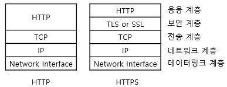

HTTPS, SSL인증서
===
## 한줄 정리
### 공인된 '인증 기관'에게 내 서버의 '주민등록증'(SSL인증서)을 발급받고, '브라우저' 통신할 때마다 제시하며 "나 인증받은 서버야." 라고 알리는 방식(HTTPS)이다.

## 세줄 정리 (매우 단순화)
1. 발급: 공인된 '인증 기관'에게 내 서버의 '주민등록증'(인증서)을 발급받는다.
2. 인증: '브라우저'가 내 서버에 접속할 때마다, 인증서를 제시하며 "나 인증받은 서버야. 안전해!" 라고 알린다.
3. 통신: '인증서'에 써둔 내 서버의 '주민번호'(key)로 데이터를 암호화하여 주고 받는다
    - 정확히는 '데이터를 암호화하는 key'를 '주민번호(서버 공개key)'로 암호화한다.
 

 

## 용어 정리
1. HTTP(Hypertext Transfer Protocol): HTML을 전송하기 위한 통신 규칙(규약)
    - HTML: Hypertext로 만들어진 문서(양식)
    - Hypertext: 링크로 연결되는 텍스트
    - 통신규약: 데이터의 첫번째 줄에는 '목차' 내용을 쓰고, 두번째 줄부터 '실제 내용'를 써서 주고 받겠다는 규칙 같은 것.
    - http://도메인주소 의 의미는 '주소'에 있는 컴퓨터와 http 방식으로 통신을 하겠다는 의미이다.
2. HTTPS(HTTP Over 'Secure' Socket Layer): SSL 위에서 동작하는 HTTP
    - 보안을 강화한 HTTP라고 볼 수 있다.
    - 데이터를 암호화하여 전송하고,
    - 내가 접속하려는 서버와 일치하는지 확인(호스트 변조 악용 등 예방)
3. SSL(TLS)
    - SSL 위에서 HTTPS가 동작한다.
    - 넷스케이프에서 발명되었고, 이후에 표준화기구(IETF)로 이관되면서 TLS로 이름이 변경됨
4. SSL 디지털 인증서
    - 클라이언트와 서버간의 통신을 제3자가 보증해주는 전자화된 문서
    - 클라이언트가 접속한 서버가 신뢰할 수 있는 서버임을 보증하고,
    - SSL 통신에 사용할 '서버의 공개키'를 클라이언트에게 제공하여, 데이터를 암호화하여 통신할 수 있게 해준다.

 

## (참고) 통신 레이어 개념
&nbsp;&nbsp;&nbsp;&nbsp;&nbsp; 

> https://chqpa.tistory.com/25

> https://shlee0882.tistory.com/110

1. 컴퓨터를 쓸 때, `컴퓨터 > 윈도우OS > 브라우저 Program > 구글 Webpage` 와 같은 계층 관계가 형성되는 것처럼,
2. 통신을 할 때도, `TCP/IP > SSL/TLS > HTTP, FTP, Telent` 과 같은 계층 구조가 형성된다.
    - TCP/IP 기반에서 SSL/TLS가 작동하고,
    - SSL/TLS 기반에서 HTTP나 FTP, Telnet 등이 작동한다.

  

## 암호화 방식
1. 대칭키 방식 : 1개의 key 사용
    - 방식: 암호화하고 복호화 하는데 동일한 key를 사용(아래 명령어를 수행하면 '대칭key'를 입력하라고 뜸)
    - 단점: key값 자체는 암호화하지 않고 주고 받으므로, 외부에 노출되면치명적이다.
    - 암호화 명령어(des3방식): `openssl enc -e -des3 -salt -in plaintext.txt -out ciphertext.bin;`
    - 복호화 명령어(des3방식): `openssl enc -d -des3 -in ciphertext.bin -out plaintext2.txt;`

 

2. 공개키 방식: 2개의 key 사용
    - 누구에게나 공개된 공개키(Public Key)와, 특정사람만 갖고 있는 비밀키/개인키(Private Key)를 사용한다.
    - 공개키로 암호화 한 건 비밀키로 복호화 할 수 있다.
    - 비밀키로 암호화 한 건 공개키로 복호화 할 수 있다.
    - 비밀키 생성(RSA방식): `openssl genrsa -out private.pem 1024;`
    - 공개키 생성(비밀키로): `openssl rsa -in private.pem -out public.pem -outform PEM -pubout;`
    - 평문 파일 생성: `echo 'coding everybody' > file.txt`
    - 공개키로 암호화: `openssl rsautl -encrypt -inkey public.pem -pubin -in file.txt -out file.ssl;`
    - 비밀키로 복호화: `openssl rsautl -decrypt -inkey private.pem -in file.ssl -out decrypted.txt`
    1. 암호화/복호화 활용
        - 누구에게나 공개된 공개키(Public Key)로 암호화 하면,
        - 나만 갖고 있는 비밀키/개인키(Private Key)로 복호화 한다.
        - 브라우저에서 ID/PW를 (서버가 전달해준)공개키로 암호화해서 서버에 보내면, 서버가 비밀키로 복호화해서 로그인 처리를 한다.(비밀키를 가진 서버만 복호화 가능)
    2. 인증 활용
        - 나만 갖고 있는 비밀키/개인키(Private Key)로 암호화 하면,
        - 누구에게나 공개된 공개키(Public Key)로 복호화 한다.
        - 서버가 비밀키로 암호화한 데이터를 공개키와 함게 보내고, 브라우저가 공개키로 데이터를 복호화하는데 성공하면, 그 서버가 비밀키를 가진 서버(공개키 발행 주체)임이 증명된다.(전자서명)

  

## SSL 디지털 인증서
### : 클라이언트와 서버간의 통신을 제3자가 보증해주는 전자화된 문서.
1. 웹브라우저가 서버에 접속하면,
2. 서버는 (제3자가 발급해준) '자신을 증명하는' SSL인증서 보내주고,
3. 웹브라우저는 받은 SSL인증서를 (제3자의 공개키로 복호화) 확인하여, 자신이 접속하려는 서버가 맞는지 체크한다.

 

## SSL의 기능
1. 클라이언트가 접속하는 서버가 신뢰할 수 있는 서버인지 체크(내가 접속하려는 서버가 진짜 맞는지)
2. 암호화를 통해 통신하는 데이터가 노출/변경되는 것을 예방
 
  

## SSL 인증서의 역할
1. 클라이언트가 접속한 서버가 신뢰할 수 있는 서버임을 보장한다.
    - 서버가 보내온 암호화된 인증서가 CA의 공개키로 복호화되면, CA가 발급한 인증서임이 증명된다.
    - 복호화된 인증서에 기록된 (CA가 보증하는) 서버의 정보도 믿을 수 있게 된다.
2. SSL 통신에 사용할 '서버의 공개키'를 클라이언트에게 제공한다.
    - 인증서 안에 '서버의 공개키'가 들어가 있다.
    - 실제 데이터는 '대칭키 방식'으로 암호화 하고, '대칭키의 key'는 '서버의 공개키'로 암호화하여 전송한다.

  

## CA(Certificate Authority)
### : SSL인증서를 발급하는 공인된 민간기업들
- 각 브라우저들은 `{공인CA: CA공개키}`를 내부에 저장하고 있다.
- 따라서, CA들이 판매하는 인증서를 구입해야만, SSL 암호화 통신을 할 수 있다.
- CA로 유명한 회사로는 Symatec, Comodo, GoDaddy, GlobalSign 등이 있다.

  

## SSL 인증서 내용
#### : 인증서는 암호화 되어있다(by CA가 CA의 비밀키로 암호화)
#### : 복호화는 브라우저가 한다(by 브라우저가 보관하는 CA의 공개키로 복호화)
1. 서비스 정보: 클라이언트가 접속한 서버가, 실제 접속하려는 서버가 맞는지 확인 용도
    - 인증서를 발급한 CA
    - 서비스의 도메인 등
1. 서버 측 공개키: 서버-클라이언트 간에 통신할 데이터를 암호화하는 '대칭키의 key를 암호화'하는 용도
    - 공개키의 내용
    - 공개키의 암호화 방법

  

## 2개의 공개키
#### : 브라우저 내부에는 CA들의 공개키가 보관되어 있다.
#### : SSL인증서에는 서비스(서버)의 공개키가 저장되어 있다.
1. CA측 공개키 (브라우저 보관)
    - 브라우저 내부에 공인 CA리스트와 함께 보관된다.
    - CA측 공개키를 이용해, 'SSL인증서를 복호화' 한다.
2. 서비스(서버)측 공개키 (인증서에 기록)
    - CA가 발급한 SSL 인증서에 기록되어 있다.
    - 서버측 공개키를 이용해, '클라이언트-서버간 통신 데이터를 암호화한 대칭키의 key'를 암호화 한다.

  

## A to Z
1. 서버 운영자가 자신만의 비밀키/공개키를 생성
1. CA에게 서비스 정보와 공개키를 전달하여 심의 받고, SSL인증서 구입
1. 브라우저가 서버에 접속
1. 서버는 (CA에게 구입하여 발급 받은) 인증서를 브라우저에 보내줌.
1. 브라우저는 (서버에게 받은) 인증서가 공인된 CA가 발급한 것인지 확인.
    - 브라우저 내부에서 관리하는 CA리스트에 있는지 체크
1. 공인된 CA가 맞다면, 인증서를 복호화
    - 브라우저 내부에서 관리하는 해당 CA의 공개키로 복호화
1. 복호화에 성공하면, 인증서가 해당 CA가 발급한 것임이 증명 => 서버의 신뢰성 보장.
    - 해당 CA의 공개키로 복호화에 성공한다면, 인증서가 해당 CA의 비밀키로 암호화 되었음이 증명되는 것이고,
    - 이는 증명서를 보낸 서버의 신뢰성이 CA에 의해 보장됨을 증명하는 것이다.
1. SSL 인증서가 공인된 CA의 것이라면, SSL 기능을 사용할 수 있게 된다. 
    - 브라우저들은 SSL인증서가 공인된 CA의 것인지 확인하기 위해, 내부적으로 "CA와 CA의 공개키" 리스트를 보관하고 있다.
1. SSL 기능을 사용하기 시작하고, 브라우저 주소창에 자물쇠가 채워진다.
    - CA 공개키를 통해, 클라이언트가 접속하려는 서버가 맞는지 확인
    - 서버 공개키를 통해, 클라이언트-서버간 전송 데이터를 암호화한 '대칭키의 key'를 암호화

  

## A to Z 요약
1. 서버: 비밀키/공개키 생성 >(서버 공개키)> 인증서 발급 요청 to CA
1. CA: 인증서 생성 > (CA비밀키)> 인증서 암호화 > 인정서 발급 to 서버
1. 브라우저: 서버 접속
2. 서버: 암호화된 인증서 전송 to 브라우저
2. 브라우저: (CA공개키)> 인증서 복호화 > 서버측 공개키 획득 >
3. 브라우저: (대칭키의 key)> 데이터 암호화 >(서버 공개키)> 대칭키의 key 암호화 > 대칭키로 암호화된 데이터 + 공개키로 암호화된 대칭키의 key 전송 to 서버
4. 서버: (서버측 비밀키)> 대칭키의 key 복호화 >(대칭키의 key)> 데이터 복호화

  

## SSL 통신 과정
### : 대칭키 방식(전송 데이터 암호화)과 공개키 방식(대칭키 key 암호화)을 혼합하여 통신한다.
### 0. SSL 인증서 생성
1. 서버의 비밀키/공개키 생성
2. '서버 공개키'를 CA 전달하면서 'SSL인증서' 발급 요청
3. CA는 'CA공개키로 암호화된 인증서' 발급
    - CA의 정보(발급자)
    - 서버의 정보(도메인, 서버 공개키 등)
### 1. Handshake(악수): 클라이언트와 서버가 통신을 하기 위해 서로를 파악하는 과정
1. 클라이언트(브라우저)가 서버에 접속: Client Hello
    - 클라이언트에서 생성한 랜덤 데이터 전송 to 서버
    - 클라이언트가 지원하는 암호화 방식들 전송 to 서버
    - 세션 아이디(식별자) 전송 to 서버
2. 서버가 클라이언트에 응답: Server Hello
    - 서버에서 생성한 랜덤 데이터 전송 to 클라이언트
    - 서버가 선택한 '클라이언트 지원 암호화 방식' 전송 to 클라이언트 (서로 암호화 방식을 맞추는 작업)
    - 인증서 전송 to 클라이언트
3. 클라이언트의 확인 작업
    - 서버에게 받은 인증서 확인: 브라우저에 내장된 CA리스트에 있는 CA의 인증서인지 확인
    - 인증서 복호화: 브라우저에 내장된 해당CA의 공개키로 복호화
        - 복호화 성공시, 인증서가 CA에 의해 발급된 것임이 증명됨
        - 인증서를 전송한 서버도 CA가 보증하는 서버임이 증명됨
    - 복호화된 인증서의 '서버 공개키' 획득
4. 클라이언트의 'pre master secret key' 생성
    - pre master secret 키 생성 : '서버에게 받은 랜덤 데이터' + '클라이언트 생성 랜덤 데이터' 조합
    - pre master secret 키 암호화: 인증서에 있는 '서버 공개키'로 암호화
    - '암호화된 pre master secret 키' 전송 to 서버
5. 서버의 'session key'(대칭키의 key) 생성
    - '암호화된 pre master secret 키'를 받아서 '서버 비밀키'로 복호화
    - '복호화된 pre master secret 키'를 이용해 master secret 값 생성하고,
    - 최종적으로 session key 생성하여 클라이언트와 공유
        - 클라이언트-서버는 데이터를 주고 받을 때, session key를 통해 '대칭키 방식'으로 암호화하여 통신한다.
6. 핸드쉐이크 종료
### 2. 세션(전송): 실제로 서버와 클라이언트가 데이터를 주고 받는 단계
1. 클라이언트의 데이터 암호화/전송
    - 'session key'를 통해 대칭키 방식으로 '요청 데이터(ID/PW 등)를 암호화'하여 서버에 전송
2. 서버의 데이터 복호화
    - 'session key'를 통해 대칭키 방식으로'데이터를 복호화' 하여 처리
    - 'session key'를 통해 대칭키 방식으로'응답 데이터(사용자 정보 등)를 암호화'하여 클라이언트에 전송
3. 클라이언트의 데이터 복호화
    - 'session key'를 통해 대칭키 방식으로'데이터를 복호화' 하여 처리
### 3. 세션 종료
1. 데이터 전송 종료
2. SSL 통신 종료
3. 'session key' 폐기
    - 매번 연결 시마다 새로운 session key를 생성하여 아주 짧은 시간만 사용하므로, 혹시 탈취되더라도 비교적 안전함.

  

  

### https
#### https 사이트는 접속 시, 실제 해당 주소의 서버에 접속한 것인지 표시된다.
#### hosts 파일 변조 들을 통한, 피싱 사이트 연결등의 위험이 차단된다.

